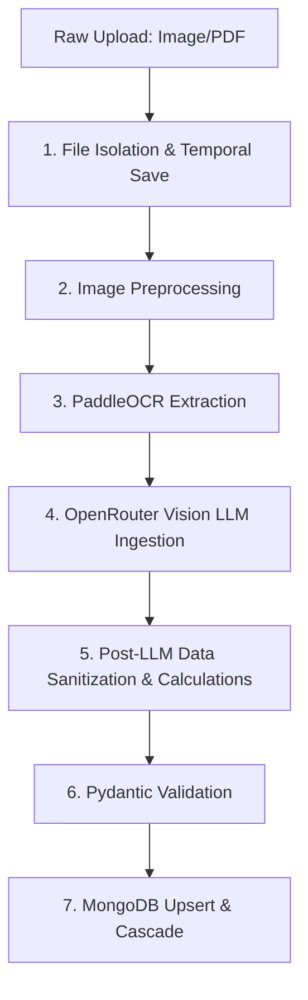

# Purchase Intelligence System: Ingestion Pipeline & Analytics Documentation

This document provides a detailed, technical explanation of the end-to-end processing pipeline of the AI-powered Purchase Intelligence System, detailing each phase from invoice upload to analytics calculations, including the mathematical formulas and algorithms applied.

---

## 🗺️ System Ingestion & Processing Pipeline

The ingestion pipeline transforms raw unstructured documents (images or PDFs) into clean, validated, structured data records stored in MongoDB.



### 1. File Isolation & Temporary Storage
When a user uploads a file through the `/upload` or `/upload/batch` API endpoints:
- A unique temporary directory is created for the file.
- The file suffix is validated (`.jpg`, `.jpeg`, `.png`, `.pdf`, `.webp`).
- The stream is copied to a temporary location using `shutil.copyfileobj` to prevent memory bloat during parallel processing.

---

## 🖼️ 2. Image Preprocessing Pipeline (`image_preprocess.py`)

A raw scan or photo contains noise, skew, bad contrast, or rotation that degrades OCR accuracy. The preprocessor cleans the image via the following stages:

#### A. PDF-to-Image Rendering
If the uploaded file is a PDF, the system extracts the first page and converts it to a PNG image using PyMuPDF (`fitz`):
- **Resolution**: Rendered at **200 DPI** to strike a balance between OCR legibility and memory footprint.
```python
pix = page.get_pixmap(dpi=200)
```

#### B. EXIF Orientation Correction
Mobile photo uploads often contain EXIF metadata tags indicating device rotation. The system uses Pillow’s `ImageOps.exif_transpose` to reconstruct the true physical orientation of the pixels:
```python
corrected_image = ImageOps.exif_transpose(image)
```

#### C. Dimensional Resizing
To prevent GPU/CPU memory out-of-bounds errors on large files, images exceeding a maximum dimension of `2000px` are downscaled while preserving their original aspect ratio using OpenCV:
$$\text{Scale Factor} = \frac{2000}{\max(\text{Height}, \text{Width})}$$
$$\text{New Dimensions} = (\text{Width} \times \text{Scale Factor}, \text{Height} \times \text{Scale Factor})$$
- Applied using OpenCV's `cv2.resize` with `cv2.INTER_AREA` (best for decimation).

#### D. Bilateral Denoising
Typical Gaussian blurring smudges text boundaries. The system uses **Bilateral Filtering** to smooth background texture noise while maintaining crisp text edge gradients:
- **Parameters**: $d = 9$ (pixel neighborhood diameter), $\sigma_{\text{color}} = 75$, $\sigma_{\text{space}} = 75$.
- This filters noise based on spatial closeness as well as radiometric (intensity) similarity.

#### E. Contrast Enhancement (CLAHE)
Standard histogram equalization causes over-amplification of noise. The system applies **Contrast Limited Adaptive Histogram Equalization (CLAHE)**:
1. Converts the image into the **LAB Color Space** (representing Lightness ($L$) and chromatic channels ($A, B$)).
2. Isolates the $L$ (Lightness) channel.
3. Applies CLAHE with a contrast limit of `2.0` and a grid tile size of `8x8`.
4. Merges the channels back and transforms the image back to BGR.

#### F. Text Deskewing
To align horizontal text lines, the preprocessor detects the page angle and corrects it:
1. Converts the preprocessed BGR image to grayscale.
2. Applies Otsu's thresholding to get a binary representation (`cv2.THRESH_BINARY_INV + cv2.THRESH_OTSU`).
3. Dilates the white pixels with a rectangular structuring element (`30x5`) to group characters into unified line segments.
4. Uses `cv2.minAreaRect` to calculate the minimum area bounding box enclosing the merged text coordinates.
5. Obtains the skew angle $\theta$:
   - If $\theta < -45^\circ$, $\theta_{\text{correct}} = -(90^\circ + \theta)$.
   - Else, $\theta_{\text{correct}} = -\theta$.
6. If the absolute skew angle is significant ($0.5^\circ \le |\theta_{\text{correct}}| \le 45^\circ$), the image is rotated using an affine transformation matrix (`cv2.getRotationMatrix2D` and `cv2.warpAffine` using `cv2.INTER_CUBIC` interpolation and replicated borders).

---

## 🔍 3. OCR Text Extraction (`ocr_service.py`)

The system extracts text coordinates and raw lines using **PaddleOCR (PP-OCRv4)**.
- **Engine Setup**: Initialized with `lang="en"`, `device="cpu"`, and `use_textline_orientation=False` to bypass redundant layout model loads.
- **Warmup Phase**: During application startup, a dummy $1 \times 1$ blank pixel array is sent to the OCR pipeline to force compilation of models, reducing latency on the first real request from $\sim 15$ seconds to sub-second runtimes.
- **Concurrency Protection**: The CPU-intensive prediction is run using `asyncio.to_thread` to prevent blocking FastAPI's single-threaded event loop.

---

## 🧠 4. Vision LLM Parsing & Correction (`llm_extractor.py`)

Once raw OCR text is available, it is paired with the preprocessed image and sent to a Vision-capable LLM via OpenRouter.

### System Prompt Engineering
The system instructs the model to act as a structured extraction agent, producing JSON matching this exact layout:
```json
{
  "dealer_name": "string",
  "invoice_no": "string",
  "date": "YYYY-MM-DD",
  "items": [
    {
      "product": "string",
      "quantity": 0.0,
      "unit": "string",
      "price": 0.0,
      "amount": 0.0
    }
  ],
  "subtotal": 0.0,
  "gst": 0.0,
  "total": 0.0
}
```

### Post-Extraction Cleanup & Surcharge Redistribution
Models frequently include non-product line items (like taxes, discount lines, or round-offs) as separate products. The system cleans these using custom Python filtering rules before database validation:

1. **Tax and Round-off Removal**: Items containing keywords like `cgst`, `sgst`, `igst`, `vat`, `tax`, `round off`, `rounding`, `discount`, or `less :` in their name are stripped out of the product list.
2. **Surcharge Accumulation**: Items representing general price additions (e.g. `price increment`, `surcharge`, `increment`, `extra charge`) are accumulated into a `price_adjustments_amount` pool.
3. **Redistribution**:
   The accumulated surcharge pool is added to the first valid product line:
   $$\text{Amount}_{\text{item 0, new}} = \text{Amount}_{\text{item 0, old}} + \text{Price Adjustments Amount}$$
   $$\text{Price}_{\text{item 0, new}} = \frac{\text{Amount}_{\text{item 0, new}}}{\text{Quantity}_{\text{item 0}}}$$
4. **Consistency Enforcements**:
   - Quantities $\le 0.0$ default to `1.0`.
   - Prices and amounts are forced to absolute values.
   - **Subtotal recalculation**:
     $$\text{Subtotal}_{\text{final}} = \sum_{i \in \text{Cleaned Items}} \text{Amount}_i$$
   - **Total recalculation**:
     $$\text{Total}_{\text{final}} = \text{Subtotal}_{\text{final}} + \text{GST}$$

---

## 📈 5. Analytical Engine & Mathematical Formulas

Once validated invoices are stored, the analytics routes query the data using MongoDB aggregation pipelines and compute purchasing insights using the following algorithms.

---

### A. Savings Opportunity Identification (`savings_service.py`)

This algorithm identifies transactions where the user paid more than the cheapest available historical price from other dealers.

#### Step 1: Compute Cheapest Available Rates
For each unique product $P$, find its cheapest supplier price:
$$\text{Cheapest Price}(P) = \min_{d \in \text{Dealers}(P)} (\text{Average Price of } P \text{ from Dealer } d)$$

#### Step 2: Compare Transactions
For every individual purchase transaction $T$ of product $P$ containing a quantity $Q$ from dealer $D$:
If $D \neq \text{Cheapest Dealer}(P)$ and $\text{Price}_{\text{Paid}}(T) > \text{Cheapest Price}(P)$:
$$\text{Potential Savings}(T) = (\text{Price}_{\text{Paid}}(T) - \text{Cheapest Price}(P)) \times Q$$

$$\text{Total User Savings Opportunity} = \sum \text{Potential Savings}(T)$$

---

### B. Price Trend Calculations (`trend_service.py`)

Tracks the historical movement of product rates over time.

#### Monthly Price Aggregations
For a given product, transactions are aggregated by calendar month:
$$\text{Average Price}_{\text{Month}} = \frac{\sum (\text{Price}_i \times \text{Quantity}_i)}{\sum \text{Quantity}_i}$$

#### Percentage Change (Trend Spread)
Let $P_{\text{first}}$ be the average price in the earliest recorded month, and $P_{\text{last}}$ be the average price in the latest recorded month.

* If $P_{\text{last}} > P_{\text{first}}$:
  $$\text{Percentage Increase} = \frac{P_{\text{last}} - P_{\text{first}}}{P_{\text{first}}} \times 100$$
* If $P_{\text{first}} > P_{\text{last}}$:
  $$\text{Percentage Decrease} = \frac{P_{\text{first}} - P_{\text{last}}}{P_{\text{first}}} \times 100$$

#### Overall Trend Classification
The overall direction of a product's price is categorized based on the trend percentage shift ($\Delta\%$):
$$\text{Classification} = \begin{cases}
\text{RISING} & \text{if } \Delta\% > 3.0\% \\
\text{FALLING} & \text{if } \Delta\% < -3.0\% \\
\text{STABLE} & \text{otherwise}
\end{cases}$$

#### Moving Average
$$\text{Moving Average} = \frac{\sum_{m=1}^M \text{Average Price}_m}{M}$$

---

### C. Purchase Volume & Product Velocity Insights (`savings_service.py`)

#### Average Purchase Frequency (Days Between Purchases)
Determines the average run-rate interval of purchases.
For a product with sorted purchase dates $t_1, t_2, \dots, t_N$:
$$\text{Purchase Frequency (Days)} = \frac{\sum_{i=2}^N (t_i - t_{i-1})\text{ days}}{N - 1}$$

#### Product Velocity Classification
$$\text{Average Quantity per Purchase} = \frac{\text{Total Quantity Purchased}}{\text{Number of Invoices}}$$
* **Fast-Growing (Fast-Moving)**: $\text{Average Quantity per Purchase} > 10$ units.
* **Slow-Moving**: $\text{Average Quantity per Purchase} \le 10$ units.

#### Co-Occurrence Analysis (Market Basket Analysis)
Identifies combinations of products purchased together. The algorithm parses all bills and count pairs:
$$\text{Co-Occurrences}(P_A, P_B) = \sum_{B \in \text{Bills}} \mathbb{I}(P_A \in B \land P_B \in B)$$
Where $\mathbb{I}$ is the indicator function (returns 1 if true, 0 if false).

---

### D. Exponential Smoothing Forecasting (`forecast_service.py`)

Uses **Simple Exponential Smoothing (SES)** to project next-month values for total shop spend, item quantities, and item prices.

#### Mathematical Model
Given historical chronological observations $Y_1, Y_2, \dots, Y_t$, the smoothed states $S_t$ are computed recursively:
$$S_1 = Y_1$$
$$S_t = \alpha Y_t + (1 - \alpha) S_{t-1} \quad \text{for } t \ge 2$$
Where:
- $\alpha = 0.3$ (smoothing factor, giving $30\%$ weight to recent actual values and $70\%$ weight to historical trends).

#### Forecast Calculation
The forecast $\hat{Y}_{t+1}$ for the next billing interval is the last computed smoothed level:
$$\hat{Y}_{t+1} = S_t$$

---

### E. Supplier Comparison & Shift Savings (`dealer_service.py`)

Enables side-by-side comparisons of two dealers ($D_A$ and $D_B$) using products they have both historically supplied.

#### Weighted Average Price
Computes the weighted average price of common products purchased from a dealer:
$$\text{Weighted Average Price}_d = \frac{\sum_{p \in \text{Common}} (\text{Average Price}_{d, p} \times \text{Quantity}_{d, p})}{\sum_{p \in \text{Common}} \text{Quantity}_{d, p}}$$

#### Average Price Difference
$$\text{Average Price Difference} = \frac{\sum_{p \in \text{Common}} |\text{Average Price}_{A, p} - \text{Average Price}_{B, p}|}{N_{\text{Common}}}$$

#### Shift Savings Opportunity
Calculates the exact amount saved if the buyer shifted all historical orders of the more expensive dealer to the cheaper dealer:
For each common product $p$:
$$\text{Opportunity}_p = \begin{cases}
(\text{Avg Price}_{A, p} - \text{Avg Price}_{B, p}) \times \text{Quantity}_{A, p} & \text{if } \text{Avg Price}_{A, p} > \text{Avg Price}_{B, p} \\
(\text{Avg Price}_{B, p} - \text{Avg Price}_{A, p}) \times \text{Quantity}_{B, p} & \text{if } \text{Avg Price}_{B, p} > \text{Avg Price}_{A, p}
\end{cases}$$

$$\text{Total Shift Savings Opportunity} = \sum_{p \in \text{Common}} \text{Opportunity}_p$$

---

### F. Category Spend Growth (`product_service.py`)

#### Month-over-Month (MoM) Growth Rate
Compares current month category expenditures against the previous month:
$$\text{MoM Growth Rate} = \frac{\text{Spend}_{\text{Current Month}} - \text{Spend}_{\text{Previous Month}}}{\text{Spend}_{\text{Previous Month}}} \times 100$$
